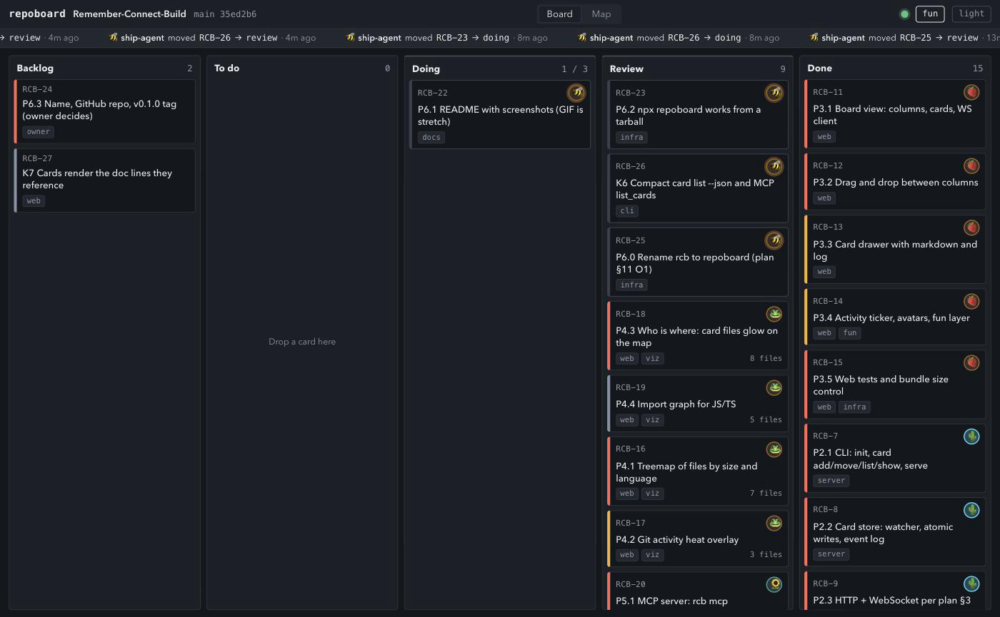
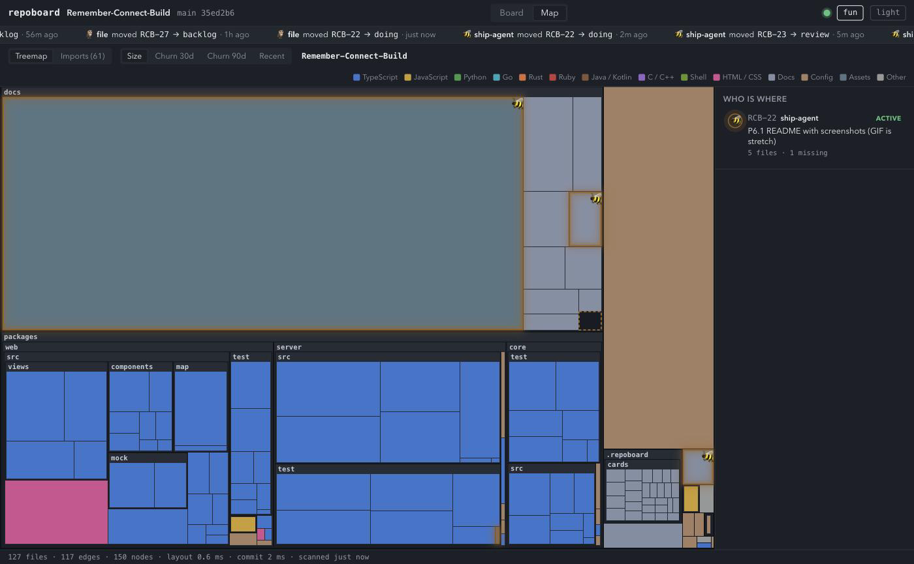

# repoboard

A Kanban board that lives in your repo as markdown files, and a local dashboard that shows the
board next to a map of the code — so you can see what your agents are doing, and where.





## Try it

Once `repoboard` is on npm (it is not yet — see Status):

```sh
npx repoboard init && npx repoboard serve --open
```

`init` writes `.repoboard/board.yml` and a first card `RB-1`; `serve` opens the dashboard on
`http://127.0.0.1:4242`. From a checkout today: `pnpm install && pnpm build`, then
`node packages/server/dist/cli.js serve --open`.

## The idea

Plain files are the database: a card is one markdown file with YAML frontmatter in
`.repoboard/cards/<id>.md`, and the columns are `.repoboard/board.yml`. Git is the history —
there is no other store, no sync, and nothing leaves the machine (the server binds `127.0.0.1`).
Any agent that can edit a file can move a card: change `status:` and a filesystem watcher pushes
the new card to every open browser — 282 ms from `sed` to board, measured 2026-09-03. The server
re-reads the file on every change and never trusts its own memory. No LLM sits in the product's
path; the agents bring the intelligence, and the board only shows it.

## For agents

Three surfaces write the same files through the same core code. Use them in this order — the
ranking is by tokens; per-operation costs measured 2026-09-03 on the built binary, standing costs
and list sizes re-measured 2026-09-07 on 31 cards (bytes on the wire, ≈4 bytes per token;
plan §11 O3):

| Surface | Standing cost | Per move | Per list |
|---|---|---|---|
| **CLI** — `repoboard card move RB-12 doing --as claude/dev` | `docs/AGENTS.md` read once: 11.5 KB | ~40 B in, 33 B out | table 2,529 B; `--json` 7,639 B; `--json --full` 20,758 B |
| **MCP** — `claude mcp add repoboard -- npx repoboard mcp` | tool schema 8.6 KB per turn where the harness loads it | ~80 B call, ~200 B result | 7,638 B — the same formatter, to the byte |
| **File edit** — `sed -i 's/^status: todo$/status: doing/' .repoboard/cards/RB-12.md` | same AGENTS.md | ~60 B, but a correct move also bumps `updated` and appends a `## Log` line | n/a |

A card can also carry a `decision:` block (P8.1) — `repoboard card ask RB-12 "Ship it?" --option
"A ship now" --option "B wait"` and `repoboard card decide RB-12 A` (or `--words "<verbatim>"`),
mirrored as MCP `ask_owner`/`record_decision` and HTTP `POST /api/cards/:id/ask|decide`. A DECIDED
card is authority: `decision.chosen`/`decision.words` are the answer, not a chat relay. See
`docs/AGENTS.md` §8 for the bytes and the wire shapes.

The CLI is the cheapest per operation and has no standing cost. MCP pays off when the agent has
no shell or its harness loads tool schemas on demand. Editing the file is the escape hatch: it
always works, and the watcher synthesizes the event (`actor: file`). `docs/AGENTS.md` is the one
page an agent needs, including a paragraph to paste into a `CLAUDE.md`.

## What it shows

- **Board** — one column per `board.yml` entry with its card count and WIP limit; each card
  shows its assignee as an avatar (emoji and color hashed from the `assignee` string), labels,
  and how many files and refs it names. Drag and drop writes the card file. A card's `refs:`
  (`docs/BUILD-PLAN.md@P6.2`, `README.md#Known issues`, `src/x.ts:L10-L20`) render in the
  drawer as the referenced lines, read from the file on every open — point, don't paste.
- **Map** — a treemap of the repo (files by size, colored by language; this repo: 141 files,
  layout under 1.2 ms on every run recorded in `docs/HANDOFF.md`), heat modes for churn over 30 and 90 days and for
  recent edits, an import graph for JS/TS (131 edges here), and *who is where*: files named on
  cards in an active column, updated within `activeWindowMinutes`, glow in the assignee's color.
- **Ticker** — the events in `.repoboard/events.jsonl`, newest first, including moves made by
  hand-editing a file. One entry per mutation, whichever surface made it: a CLI or MCP move is
  reported under its own actor, a hand edit as `file`, and neither is reported twice (K8).

## Config

`.repoboard/board.yml` (plan §2; `init` writes this):

```yaml
prefix: RB
activeWindowMinutes: 30
columns:
  - id: backlog
    title: Backlog
  - id: todo
    title: To do
  - id: doing
    title: Doing
    active: true
    wip: 3
  - id: review
    title: Review
    active: true
  - id: done
    title: Done
    done: true
```

`status:` on a card is a column `id`. `active: true` marks the columns whose cards count as
"in progress" for the map; `wip` is a soft limit — a move past it warns and still moves.

## Develop

```sh
pnpm install
pnpm test        # vitest (250 tests) + a gzipped-bundle size check (135.7 KB JS, limit 600 KB)
pnpm typecheck && pnpm lint
pnpm dev         # server + web with hot reload
pnpm build       # packages/server/dist/cli.js, self-contained with the built web app
```

`packages/core` (domain, no I/O), `packages/server` (CLI, HTTP, WebSocket, watcher, MCP),
`packages/web` (Vite, React, d3). The plan and every settled decision: `docs/BUILD-PLAN.md`;
the running record: `docs/HANDOFF.md`.

## Status

Pre-1.0. `repoboard@0.1.0` packs to a 267 KB tarball of 8 files and runs from `npx` in a foreign
repo (2026-09-03), but it is not published yet. `@repoboard/core` stays `private` for v0.1 (plan
§11 O4) — depend on `repoboard`. It now packs as built JS with `.d.ts` (23,896 bytes, 38 entries,
no `src/`), so removing one `"private": true` line is all that stands between it and a publish;
that call is the owner's. No GitHub repo until after v1 (O2).

## Known issues
(numbered `K1` upward; a commit that closes one says `Closes K<n>` and edits this list)
- ~~**K1** A card whose `title:` contains a colon (`P3.1 Board view: columns`) is invalid YAML
  unless quoted, and an agent writing frontmatter by hand will do this. Found on 7 of the first 24
  cards written by the orchestrator (2026-09-02).~~ Closed 2026-09-06 with all three options:
  (a) `AGENTS.md` says quote it; (c) every surface quotes on serialize, so a recovered card
  self-heals on its first write; and now (b) — after `YAML.parse` throws, `parseCard` retries
  **once** with only the `title:` value quoted (by the YAML writer, not by concatenating quotes),
  and returns the **original** error if that also fails, since the reader never wrote the rewrite.
  It never runs on a document that parsed, so no valid file changes meaning; it declines values
  starting `| > & * ! # { [ " '` and any rewrite that would span lines. What it cannot do is read
  minds: a trailing `# comment` on an unquoted title line is folded into the title. Measured:
  parse outcome differs on 0 of this repo's 30 cards; tests 197 → 210.
- ~~**K2** `Event.type` narrow in core; server carried its own superset.~~ Closed: core widened to
  `'move' | 'update' | 'create'` with `from: string | null`; server type deleted.
- ~~**K3** `lines` reported `0` for binary and >2 MB files.~~ Closed: `number | null` in core,
  scanner emits null (1 file in this repo), map shows "—".
- ~~**K4** `createCard` throws on an unknown status.~~ Closed: returns `{ok:false, error}` like
  `moveCard`; CLI and HTTP use the result.
- **K5** `@repoboard/core` is not published. The packaging half is done (2026-09-06): a
  `publishConfig` block carries the published shape — `main`, `types` and an `exports` map into
  `./dist` — while the top-level keys stay on `./src/index.ts`, so the workspace still resolves
  core from source and `pnpm test` on a clean clone needs no build. A `prepack` script builds
  `dist/` so a pack cannot ship a manifest naming files it does not contain. Verified by content,
  not by exit code: `pnpm pack` produces 23,896 bytes / 38 entries with 0 `src/` entries, the
  packed manifest has `main`/`types`/`exports` rewritten to `./dist` and lifecycle scripts
  stripped, and the tarball, extracted into a throwaway consumer outside the repo, imports by
  bare specifier on plain Node with `parseCard`/`serializeCard`/`moveCard`/`createCard` all
  present. **What remains is the owner's**: delete `"private": true` and publish. That is the one
  step, and it is gated on P6.3 with O2 (plan §11 O4).
- ~~**K6** `repoboard card list --json` is 14.1 KB against 1.9 KB for the table (2026-09-03, 24 cards)
  because it includes every body.~~ Closed: `--json` is compact by default (id, title, status,
  assignee, priority, labels, files, updated; one row per line), `--full` adds bodies; MCP
  `list_cards` uses the same rows and formatter, with `full: true` for bodies. Measured on this
  repo's 27 cards, bytes: CLI `--json` 18,290 → 6,433; `--json --full` 16,240; table 2,149;
  MCP `list_cards` result 8,506 → 6,432 (`full: true` 16,239).
- ~~**K7** A card that points at a doc section (`Task P6.2 in docs/BUILD-PLAN.md §5`) shows only
  the pointer; the reader has to leave the board to learn what the task is.~~ Closed (plan §11
  O5, 2026-09-03): cards carry `refs:` (`path#Heading`, `path@Token`, `path:L10-L20`, `path`;
  `docs/AGENTS.md` §4) and the drawer, `card show --resolve` and MCP `get_card`
  (`resolveRefs: true`) render the lines live from the file through `GET /api/cards/:id/refs`,
  never cached; caps 200 lines / 16 KB per ref; an unresolvable ref is `text: null` plus an
  error. One path guard (`resolveRepoPath`) rejects absolute, `..`, `.git/` and symlinks out of
  the repo. Measured: RCB-22..26 converted from quoted blocks to refs, 5,306 → 3,895 body-file
  bytes (12 refs); tests 145 → 191.
- ~~**K8** A CLI `card move` while `serve` runs puts two entries in the ticker.~~ Closed
  (2026-09-06). The recorded trigger was wrong twice over: the hand edit is incidental — a CLI
  mutation alone is enough, because the CLI is a second process and the watcher sees both the card
  file and `events.jsonl` — and the duplicate had two modes, because the two watcher deliveries
  race. In the `cards/*.md`-first mode the ticker showed `file` twice and **the CLI's own event was
  never emitted**: `appendEvent` added its own line's length to `eventsBytes`, a read offset, so a
  foreign line appended since the last read left the offset short by exactly that much and the next
  read sliced mid-line. Fix: `appendEvent` catches up before appending, and the watcher synthesises
  only for a change nobody claimed — a claim being an event with `ts === card.updated`, counted
  only when `updated` actually moved. That freshness test is load-bearing: without it a later `sed`
  on `status:` alone matches a spent claim and the `file` event goes silent, which is the product's
  headline behaviour. Measured on the built binary, events on the ticker per mutation:
  `card add` 2 → 1, `card move` 2 → 1, `sed` after a CLI move 1 → 1, `sed` bumping `updated`
  1 → 1; tests 191 → 197.
- ~~**K10** Map-only mode (P7.2) is read-only in practice but not by construction. Serving a repo
  with no `.repoboard/` writes nothing — verified on a throwaway clone and again by the
  orchestrator on its own fixture 2026-09-07: after a full start/scan/stop, `git status
  --porcelain` empty and `.repoboard/` absent. But a **mutating request still works**:
  `POST /api/cards` against a boardless root returns `201` and materialises
  `.repoboard/cards/RB-1.md` plus `events.jsonl` inside a repo that never opted in, because
  `writeCard`/`appendEvent` both `mkdir(..., {recursive:true})` unconditionally. The web UI never
  sends that request, and the server binds `127.0.0.1`, so no user action reaches it today — but
  plan §11 O7 states the guarantee about *serving*, and this is a write path into a foreign repo
  that nothing forbids. Fix: refuse every mutation when `hasBoard` is false, in the one funnel all
  four of `create`/`move`/`update`/`appendLog` pass through, so a fifth mutating method cannot
  forget it. `repoboard init` is unaffected — `cmdInit` writes files directly, not through the
  store.~~ Closed 2026-09-07 (RCB-35). The guard is not in `enqueue`: measured, the watcher queues
  `loadConfig`, `loadEvents`, `refreshCard` and `removeCardFile` through that same funnel and they
  must keep running in map-only mode. It sits one level narrower, in `writeCard` and `appendEvent`
  — the only two functions in the store that put a byte on disk, `await mkdir|writeFile|appendFile|
  rename` appears nowhere else in the file, and a test asserts that — where it throws `MapOnlyError`
  before any directory is created. A `mutate()` funnel replaces `enqueue` in `create`/`move`/
  `update`/`appendLog` and converts that throw to K4's `{ok:false, error, readOnly:true}`; HTTP maps
  `readOnly` to **409**, MCP already surfaced any `{ok:false}` as an error result and needed no
  change. A fifth mutating method cannot forget the guard: it cannot write without one of the two
  writers. `POST /api/cards` against a boardless root is now `409` with `.repoboard/` still absent;
  `repoboard init` still works there and unlocks the board after a restart. Tests 231 → 242.
- ~~**K9** There is no way to set a card's `assignee` after `card add`. The CLI has
  `add, move, list, show` only (`packages/server/src/cli.ts`); MCP has `update_card`, and HTTP
  has `PATCH`, so the gap is the CLI alone. HANDOFF §7.9 asked for exactly this in 2026-09-03
  ("briefs should say to set both, or the CLI's `move` should offer `--assign`") and it never got
  a ticket; all three agents on 2026-09-06 were briefed to run `card update --assignee`, all
  three hit `unknown card command "update"`, and all three set the field by hand-editing
  frontmatter. Options: `card update <id> [--assignee|--priority|--label|--file|--ref]`, or
  `--assign` on `card move`.~~ Closed 2026-09-07 (RCB-31, plan §11 O8 chose `card update`).
  `repoboard card update <id> --title --assignee --priority --label --file --ref --clear --as` is
  the CLI's surface onto the same `updateCard` MCP `update_card` and `PATCH /api/cards/:id` already
  call, so core gained nothing: a repeatable flag **replaces** its list rather than appending, and
  `--clear assignee|priority|labels|files|refs` is the one new concept — the shell's way to send
  the `null` the other two surfaces carry as JSON. The finding that mattered is where the `--status`
  refusal actually lives: **not in core**. Measured by deleting the CLI check and reading the card
  back — `card update RB-1 --status doing --assignee a` then exits **0**, sets the assignee and
  drops the status silently, because the CLI never puts `status` into the patch, so core's
  `'status' in patch` guard (`transitions.ts:147`) is unreachable from this surface. The CLI check
  is the whole guarantee, and the test asserts the card is byte-identical afterwards. `docs/AGENTS.md`
  no longer tells agents to hand-edit frontmatter for this. Verified on the built binary against a
  throwaway fixture, and one `card update` with `serve` running put **exactly one** line in
  `events.jsonl` (4 → 5, zero `actor: "file"` events); tests 242 → 250.
