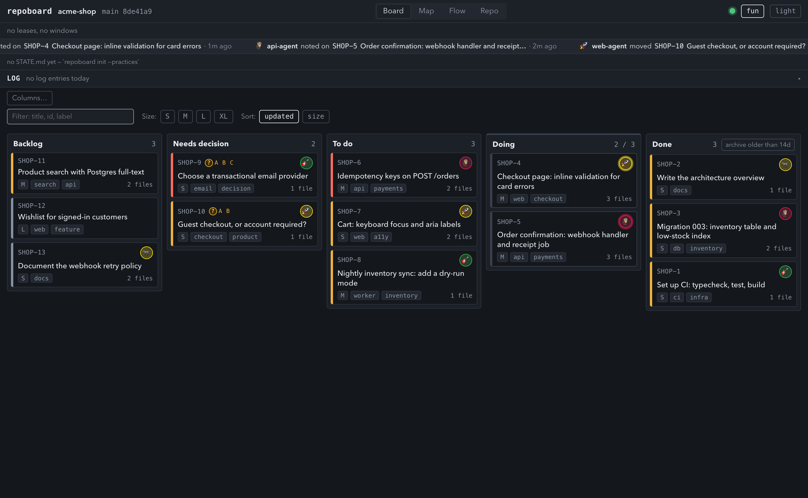
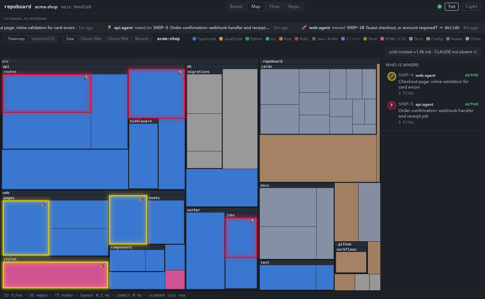
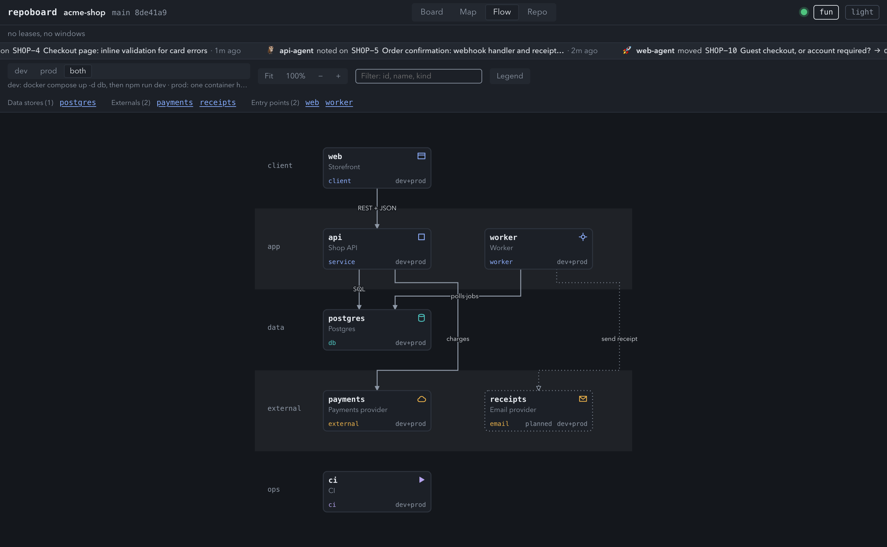

# repoboard

A Kanban board that lives in your repo as markdown files, and a local dashboard that shows the
board next to a map of the code — so you can see what your agents are doing, and where.







## Try it

Inside any git repo (Node 20.19 or newer):

```sh
npx repoboard init && npx repoboard serve --open
```

`init` writes `.repoboard/board.yml` and a first card `RB-1`; `serve` prints its address,
`http://127.0.0.1:4242` by default, and `--open` opens it in your browser. If port 4242 is taken,
`serve` stops with `port 4242 is already in use` — pass `--port <n>` to use another. Ctrl-C stops
the server.

The repo is at https://github.com/prism-nexus/repoboard; contributions go through
[`CONTRIBUTING.md`](CONTRIBUTING.md).

## The idea

Plain files are the database: a card is one markdown file with YAML frontmatter in
`.repoboard/cards/<id>.md`, and the columns are `.repoboard/board.yml`. Git is the history —
there is no other store, no sync, and nothing leaves the machine (the server binds `127.0.0.1`).
Any agent that can edit a file can move a card: change `status:` and a filesystem watcher pushes
the new card to every open browser — 282 ms from `sed` to board, measured 2026-09-03. The server
re-reads the file on every change and never trusts its own memory. No LLM sits in the product's
path; the agents bring the intelligence, and the board only shows it.

## For agents

Three surfaces write the same files through the same core code. Use them in this order — the
ranking is by tokens; per-operation costs measured 2026-09-03 on the built binary, standing costs
and list sizes re-measured 2026-09-07 on 31 cards, the AGENTS.md size re-measured 2026-10-01,
the MCP schema size re-measured 2026-09-30 (bytes on the wire, ≈4 bytes per token; plan §11 O3):

| Surface | Standing cost | Per move | Per list |
|---|---|---|---|
| **CLI** — `repoboard card move RB-12 doing --as claude/dev` | [`docs/AGENTS.md`](docs/AGENTS.md) read once: 26.2 KB (measured 2026-10-01) | ~40 B in, 33 B out | table 2,529 B; `--json` 7,639 B; `--json --full` 20,758 B |
| **MCP** — `claude mcp add repoboard -- npx repoboard mcp` | tool schema 27.9 KB (30 tools, measured 2026-09-30) per turn where the harness loads it | ~80 B call, ~200 B result | 7,638 B — the same formatter, to the byte |
| **File edit** — `sed -i.bak 's/^status: todo$/status: doing/' .repoboard/cards/RB-12.md` (`-i.bak` runs on GNU and macOS `sed`; delete the `.bak`) | same AGENTS.md | 70 B of command (counted 2026-09-30), but a correct move also bumps `updated` and appends a `## Log` line | n/a |

The systems model adds a 66 B `seat` line and `.repoboard/systems.yml` (2,558 B here) to the cold
read; `repoboard systems` is 517 B (all three measured 2026-10-01 on this repo's board); `systems
show <id>` resolves pointers and can run to tens of KB — [`docs/REFERENCE.md`](docs/REFERENCE.md)
§7.

A card can also carry a `decision:` block (P8.1) — `repoboard card ask RB-12 "Ship it?" --option
"A ship now" --option "B wait"` and `repoboard card decide RB-12 A` (or `--words "<verbatim>"`),
mirrored as MCP `ask_owner`/`record_decision` and HTTP `POST /api/cards/:id/ask|decide`. A DECIDED
card is authority: `decision.chosen`/`decision.words` are the answer, not a chat relay. See
[`docs/REFERENCE.md`](docs/REFERENCE.md) §1 for the bytes and the wire shapes.

A sibling file, `.repoboard/leases.yml` (P8.2), tracks who holds a named resource and the time
windows during which one is claimed — `repoboard lease take vitest-lock --until +90m`,
`repoboard window check vitest-lock` (exit 0 clear / 1 blocked, so a lock shim can call it before
starting a test run), mirrored as MCP `take_lease`/`release_lease`/`list_leases`/`add_window`/
`check_window` and HTTP `GET /api/leases`, `POST /api/leases/take|release|windows`. A lease past
`until` reads STALE, never silently held. See [`docs/REFERENCE.md`](docs/REFERENCE.md) §2.

Two more plain files round out the practices program (P8.3): `.repoboard/STATE.md` — one page,
rewritten in place, never appended, with an Owner queue generated fresh from cards that need a
decision every time it's read (never stored) — and `.repoboard/log/YYYY-MM-DD.md`, one file per
day that every seat appends its own `##### <SEAT> <ts>: <title>` block to. `repoboard state
--set-section LIVE "Tree is dev."`, `repoboard log --as claude/ops "armed the fires"`, and
`repoboard check` round-trip through MCP `get_state`/`set_state_section`/`append_repo_log`/`check`
and HTTP `GET /api/state`, `PUT /api/state/section`, `GET/POST /api/log`, `GET /api/check` the
same way. `repoboard init --practices` scaffolds all of it (plus a root `NEXT-AGENT-PROMPT.md`),
never overwriting a file that already exists. See [`docs/AGENTS.md`](docs/AGENTS.md) §8 and
[`docs/REFERENCE.md`](docs/REFERENCE.md) §3.

`repoboard check` prints `ok`, or one line per finding; every finding is an `error`, a `warning`
or `info`, and `exitCodeForFindings` (`packages/core/src/state.ts`) is the one place that turns
them into the exit code, for the CLI, HTTP and MCP alike:

- **Exits 1 always (error):** `stale-state` (the STATE stamp is older than the newest log entry),
  `stale-lease`, `cost-over-budget`, `systems-invalid`, `seat-duplicate-bullet`,
  `pane-holds-two-seats`, `public-denylist-invalid`, `public-denylist-hit`, and at a workspace
  root `workspace-member-missing`.
- **Exits 1 only with `--strict` (warning):** `active-without-lease` (a card working with no
  lease held), `needs-ask`, `future-stamp`, `local-unsynced`, `systems-stale`,
  `systems-unblocker-unknown`, `systems-planned-without-unblocker`, `untracked-cards`,
  `seat-owner-queue-drift`, `seat-name-ambiguous`, `seat-log-while-down`, `seat-up-dead-holder`,
  `seat-lease-bullet-drift`, `workspace-key-name-mismatch`, and with board.yml's `workspace:`
  `seat-copy`, `seat-home-unreadable`, `seat-home-not-member`. Without `--strict` they print and
  the exit code stays 0 — a fresh repo's first `check` prints `untracked-cards` (the cards are
  not committed yet) and exits 0.
- **Never exits 1 (info):** `live-lease`, `needs-decision`, `gated-steps`, `local-no-remote`,
  `public-denylist-missing`.

`repoboard cost [--root <dir>] [--budget <bytes>]` (P8.4) answers what a COLD agent loads before
it does anything: bytes (and ≈tokens at 4 B/token) of `CLAUDE.md` and its variants, `AGENTS.md`
and its variants, every repo-relative path `CLAUDE.md` names in backticks that exists, and the
NAMES of any `.mcp.json` MCP servers. Exit 1 when `CLAUDE.md` exceeds its budget (default 8192 B,
or `board.yml`'s `claudeMdBudgetBytes:`) — the same check `repoboard check`'s `cost-over-budget`
finding makes error-grade. `--root` measures ANY directory, board or no board — the motivating
measurement was a member repo's own `CLAUDE.md`, which reached 32,620 B before anyone measured
it. MCP `cost`, HTTP `GET /api/cost`, and a tile on the Map view. See [`docs/REFERENCE.md`](docs/REFERENCE.md) §4.

`.repoboard/systems.yml` (RCB-95–99) is the one architecture model: systems with kind/layer/env
and pointers into the repo, connections between them, both dev and prod environments, provenance
on every row. `repoboard systems [--json]` lists it, `repoboard systems show <id> [--json]`
resolves a row's pointers, `repoboard systems detect [--apply]` proposes rows from the files
already on disk (dry-run by default, a hand row always wins, provenance stamped on every merge).
`repoboard seat <name>` prints one Systems line, `repoboard check` gains `systems-invalid` and
`systems-stale`, and the Flow view draws it. This repo's own file is 4 systems, 2 connections,
prod none. See [`docs/REFERENCE.md`](docs/REFERENCE.md) §7, §8.

A row or connection can also carry `status: live | planned | blocked` (absent means `live`) and
`unblocked_by: [<card id>…]` (RCB-161) — `repoboard systems` gains a `STATUS` column once any row
is non-`live`, `systems show <id>` resolves each unblocker inline (its title/status plus its open
decision or next unblocked step), the Flow view draws a planned/blocked box or edge dashed with a
status badge and the drawer gets an "Unblocked by" section, `check` reports a dangling id
(`systems-unblocker-unknown`, warning) or a planned/blocked row with none (`systems-planned-without-
unblocker`, warning), and `detect` proposes `external`/`planned` for a no-signal package matching a known
integration name (`shopify`, `stripe`, `qbo`, …) or living under `integrations/` instead of
leaving it unclassified. A hand `rejected:` entry (RCB-162 — a system id, or a connection's
`from`/`to`, each with a required `why`) keeps `detect --apply` from ever re-proposing a row the
repo already turned down. `repoboard systems` itself stays display-only (RCB-163): a dangling
`unblocked_by` id prints a `warning: <message>` line but never changes the exit code — `check`
reports it too, as a warning, which exits non-zero only with `--strict`.

`repoboard archive [--older-than 14d] [--dry-run]` (P8.5) moves `done` cards older than the
cutoff to `.repoboard/archive/` — `git mv` when tracked, else a rename, always byte-identical; the
board's own `done` column header has an "archive older than 14d" button that does the same thing.
`repoboard sync-issues <path>#<heading> [--dry-run] [--root <dir>]` turns a README's `## Known
issues` list into cards without copying a word of it: a card for every open `- **K<n>` entry, a
move to done for every one that's struck or gone, idempotent by `refs: [<path>@K<n>]`, and it
**never writes the source file** — measured read-only against a member repo's own 3,300+ line
README three times as the file moved under this task (64 create / 0 close / 0 malformed each
time; `git status --short` unchanged before and after every run). MCP `archive_cards`/
`sync_issues`, HTTP `POST /api/archive`/`POST /api/sync-issues`. See [`docs/REFERENCE.md`](docs/REFERENCE.md) §5.

`repoboard local init [--remote <url>]` (RCB-83) makes `.repoboard/local/` — a second, gitignored
git repo nested inside this one, for the machine facts a public repo must not ship: `RIG.md`
(build, ports, locks, seat names, other repos on this machine). `--remote` points it at a private
backup that needs no extra step; `repoboard local sync`/`local status` commit-and-push and report
drift, and `seat`/`log` sync it automatically after every write. `repoboard check`'s
`local-unsynced`/`local-no-remote` findings watch it the same way `stale-lease` watches leases. The
running record follows the layer: `local init` moves an existing `STATE.md` and `log/` into it
unless git tracks them — a tracked one stays where it is (`kept .repoboard/STATE.md (tracked in
git; …)`) unless you pass `--move-record`, which moves it and stages its removal from the parent
repo. Where it was moved, `seat`/`log` read and write it there (old log entries left at the top
level are still read).

The CLI is the cheapest per operation and has no standing cost. MCP pays off when the agent has
no shell or its harness loads tool schemas on demand. Editing the file is the escape hatch: it
always works, and the watcher synthesizes the event (`actor: file`). [`docs/AGENTS.md`](docs/AGENTS.md) is the one
page an agent needs, including a paragraph to paste into a `CLAUDE.md`.

## What it shows

- **Board** — one column per `board.yml` entry with its card count and WIP limit; each card
  shows its assignee as an avatar (emoji and color hashed from the `assignee` string), labels,
  and how many files and refs it names. Drag and drop writes the card file. A card's `refs:`
  (`docs/BUILD-PLAN.md@P6.2`, `README.md#Known issues`, `src/x.ts:L10-L20`) render in the
  drawer as the referenced lines, read from the file on every open — point, don't paste.
- **Map** — a treemap of the repo (files by size, colored by language; this repo: 481 files),
  heat modes for churn over 30 and 90 days and for recent edits, an import graph for JS/TS (517
  edges here; both counts from the scanner on 2026-09-30), and *who is where*: files named on
  cards in an active column, updated within `activeWindowMinutes`, glow in the assignee's color.
- **Flow** — the systems diagram from `.repoboard/systems.yml` (rows by layer, a dev/prod/both
  switch, one-env systems dashed), with a drawer for each box's fields, live pointers, and
  backlinks, a strip of data stores, externals and entry points, and step-by-step walks of the
  file's named `paths:` (see [`docs/REFERENCE.md`](docs/REFERENCE.md) §8).
- **Ticker** — the events in `.repoboard/events.jsonl`, newest first, including moves made by
  hand-editing a file. One entry per mutation, whichever surface made it: a CLI or MCP move is
  reported under its own actor, a hand edit as `file`, and neither is reported twice.

## Config

`.repoboard/board.yml` (plan §2; `init` writes this):

```yaml
name: My Project
siblings:
  - name: another-board
    url: http://localhost:4243
prefix: RB
activeWindowMinutes: 30
columns:
  - id: backlog
    title: Backlog
  - id: decide
    title: Needs decision
    decision: true
  - id: todo
    title: To do
  - id: doing
    title: Doing
    active: true
    wip: 3
  - id: done
    title: Done
    done: true
```

`status:` on a card is a column `id`. `active: true` marks the columns whose cards count as
"in progress" for the map; `wip` is a soft limit — a move past it warns and still moves; and
`decision: true` (O11) marks the column `ask` moves a card into and `decide` moves it back out of.
`name` (RCB-41) is optional — absent means the top bar and tab title show the served folder's
name instead. `siblings` (RCB-42) is optional too — other running boards, shown as plain top-bar
links; `serve --sibling <name>=<url>` (repeatable) adds more for that process only, and on a name
collision the flag wins. `serve --root <dir>` is repeatable too (RCB-43) — the first is the
primary and opens immediately, every later one is just registered and opens lazily, on first
request. Every route also exists per root, at `/api/repos/<key>/…` — unprefixed paths still mean
the primary, so nothing already served changes. The web (RCB-43 slice 3) shows a repo picker in
the top bar once 2+ roots are served — picking one navigates to `?repo=<key>` (or back to the
plain URL for the primary), which survives a reload. `logDir` (P8.6) is optional too — a repo-root-relative path to an
additional directory of daily `<YYYY-MM-DD>.md` files (e.g. `docs/log`) that `repoboard check`
reads alongside `.repoboard/log/`; `repoboard log` never writes there, and an absent or
nonexistent `logDir` behaves exactly like today. `shortName` (RCB-195) is optional — the board's
short name in a seat's holder label (`1D3F · rcb builder`: the first four characters of the
holder's terminal pane, this name, the seat), matching `[A-Za-z0-9][A-Za-z0-9_-]*`; absent means
the `prefix` lowercased. `seats.identityEnv` (RCB-195) is optional — a list of environment
variable names, in order, that name a holder's terminal pane (the first non-empty one wins, and
its part after the last `:` is the pane); absent means `ITERM_SESSION_ID`, `TERM_SESSION_ID`,
`CLAUDE_CODE_SESSION_ID`. `columns` (RCB-34/P7.3, plan §11 O6) is also
editable from the app itself (`PATCH /api/board`) — saving there rewrites this whole file through
the same serializer `init` uses, so every other key survives but hand-written YAML comments do
not; cards already on disk are never touched, and one in a column you remove still shows, marked
"not in board.yml".

## Workspace

A workspace is a normal board whose `board.yml` lists member boards it coordinates — the shape a
seat needs to work across several repos from one cold start (RCB-153):

```yaml
name: acme-workspace
prefix: WS
repos:
  - key: acme                 # ^[a-z0-9][a-z0-9-]*$ — the CLI/MCP/`/api/repos` key
    root: ../acme             # relative to THIS board's root, or absolute; `~` expanded
    writes: cards             # optional; absent = read-only member (O7's read-only default)
  - key: repoboard
    root: ../repoboard
```

A board with no `repos:` is exactly today's board — nothing here changes it. At a workspace root:
`state` and `check` aggregate every member (`[<key>] `-prefixed lines, a missing member shown as
`(missing)`/`workspace-member-missing` rather than a crash); `card show`/`move`/`note`/`ask`/
`decide`/`update <id>` resolve `<id>` across every board by its `prefix:` (`<key>:<id>` always
works when a prefix collides); `card list --repo <key>|all`; `card add --repo <key>`. `serve` with
no `--root` at all serves the workspace plus every member in one process, keyed by each member's
own configured `repos[].key` (any `--root` flag turns the expansion off: exactly the roots you
name are served, keyed by folder name as before). `init --workspace --repo <key>=<path>`
(repeatable) scaffolds `board.yml`'s `repos:` for you.

**O7, with teeth: `writes: cards`.** Listing a member is consent to READ it — `state`/`check`/
`card show`/`serve` never write a byte into it. Listing one is NOT consent to write to it: a card
write verb targeting a member with no `writes: cards` refuses with `member <key> is read-only (set
writes: cards in board.yml)`, and touches nothing. The only value in v1 is `cards` — even then, a
write only ever touches that member's own card file and appends one line to its own
`events.jsonl`; its `STATE.md`, log, leases, gate ledger and `.repoboard/local/` are never touched
from the workspace, no matter what `writes:` says.

Details, every command's exact behaviour, and the bytes measured: [`docs/REFERENCE.md`](docs/REFERENCE.md) §3 "Workspace".

## Develop

```sh
pnpm install
pnpm test        # vitest (2399 passed, 4 skipped) + a gzipped-bundle size check (163.8 KB JS, limit 600 KB) — measured 2026-09-30
pnpm typecheck && pnpm lint
pnpm dev         # server + web with hot reload
pnpm build       # packages/server/dist/cli.js, self-contained with the built web app
```

After `pnpm build`, run your checkout's CLI with `node packages/server/dist/cli.js serve --open`
(the built file is the `repoboard` bin, so `init`, `card` and `check` run the same way).

`packages/core` (domain, no I/O), `packages/server` (CLI, HTTP, WebSocket, watcher, MCP),
`packages/web` (Vite, React, d3). The plan and every settled decision: [`docs/BUILD-PLAN.md`](docs/BUILD-PLAN.md);
how this repo dispatches subagents: [`docs/SUBAGENTS.md`](docs/SUBAGENTS.md); the running record is
this repo's own board, the cards in `.repoboard/cards/`.

The card store's watcher has two tuning knobs reachable only through the library's
`openStore(root, opts)` — no CLI flag or `board.yml` key sets either one. `reconcileMs` (RCB-157)
periodically re-stats tracked files and routes anything the watcher itself never reported;
default `2000`ms while `watch: true`, else `0`, and `<= 0` always turns it off. `emptyGraceMs`
(RCB-164) holds a 0-byte read of a known card file — a slow in-place write can look like a
removal — before re-checking it; default `1000`ms, `<= 0` reproduces the old un-held behaviour.
`REPOBOARD_WATCH_DIAG=1` (RCB-157, set on CI's `pnpm test` step) turns on an opt-in trace of the
watcher's lifecycle per store root, printed when a test's `waitForEvent` times out; any other
value is inert.

## Status

Pre-1.0, at 0.3.1. On npm as `repoboard` since 2026-09-25 (`npx repoboard` or `npm install -g
repoboard`). It needs Node 20.19 or newer: its dependencies `chokidar` 5.0.0 and `readdirp` 5.1.1
each declare `node >= 20.19.0` in their own `package.json`, and `engines.node` in this tree is
`>=20.19.0`. `repoboard@0.3.1` packs to a 449.4 kB tarball of 8 files (measured 2026-10-01 with
`npm pack` in `packages/server` after `pnpm build`). `@repoboard/core` is internal: not
published, bundled into the CLI (`packages/server/tsup.config.ts`'s `noExternal`) — depend on
`repoboard`.

Install-time weight, not tarball weight: installing `repoboard` resolves 5 production transitive packages for
`packages/server` (chokidar, readdirp, ws, yaml, zod; `pnpm-lock.yaml`, measured 2026-09-25). It was 98 until
RCB-152 replaced `@modelcontextprotocol/sdk` (93 of the 98, about 23.8 MB of `node_modules/.pnpm`) with a
dependency-free stdio JSON-RPC server, `packages/server/src/mcp-rpc.ts`; the SDK stays a dev dependency, used
only by the tests' MCP client.

## Known issues
(numbered `K1` upward; a commit that closes one says `Closes K<n>` and edits this list)

None open: K1–K16 are closed; the next is K17.
